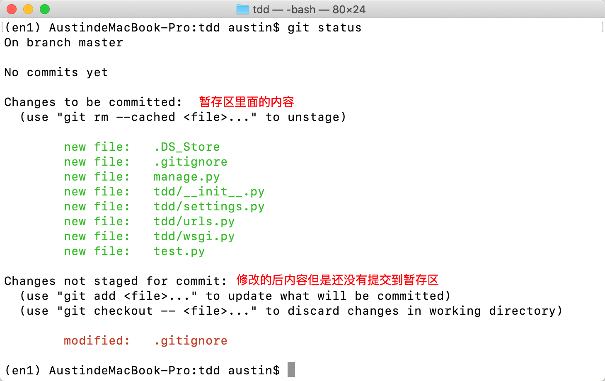

> [TOC]

## 安装的git

> 在mac上安装git

首先查看电脑上是否已经安装git

```
git --version
```


## 创建ssh key，配置git

1. 设置用户名和邮件(github上的每次提交会记录)

   ```
   git config --global user.name "yangweidong"
   git config --global user.email "1648197192@qq.com"
   
   ```

2. 拖过终端命令创建ssh密钥

   ```
   ssh-keygan -t rsa -C "1648197192@qq.com"
   ```

   然后一直回车，找到有一个id_rsa.pub文件打开，复制里面的内容

3. 登录github，添加ssh，点击设置


4. 链接验证

   ssh -T git@github.com

   如果输出successfully的一段话，说明已经是输出成功！

## 提交本地项目到github上

1. 在github上创建一个项目，并且填写相关信息

2. cd到一个文件夹，然后克隆工程到本地，首先直接复制ssh地址

   git clone 链接

3. 在克隆的文件夹里面进行修改

4. 然后提交修改

   ```
   git add .
   git commit -m "First Commit"
   git push
   ```

5. 然后在github网站刷新一下页面就可以砍价推送的新的文件了

## 中文显示数字的

git config -\-global core.quotepath false


### 忽略相关内容



