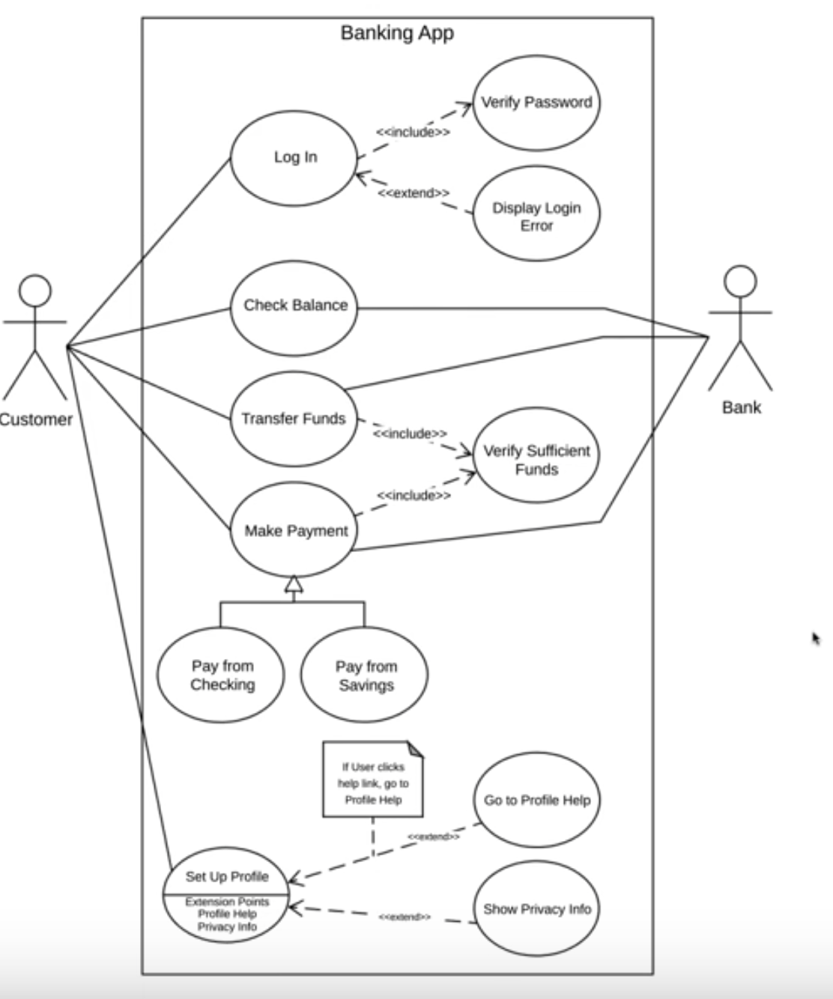
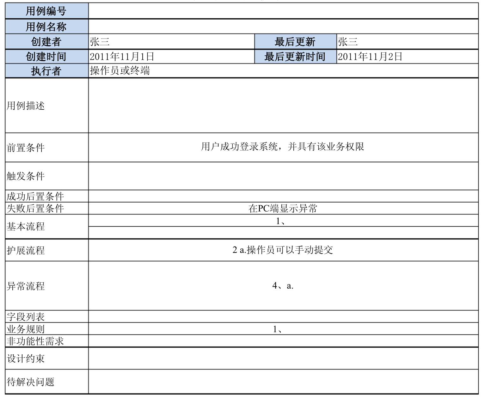
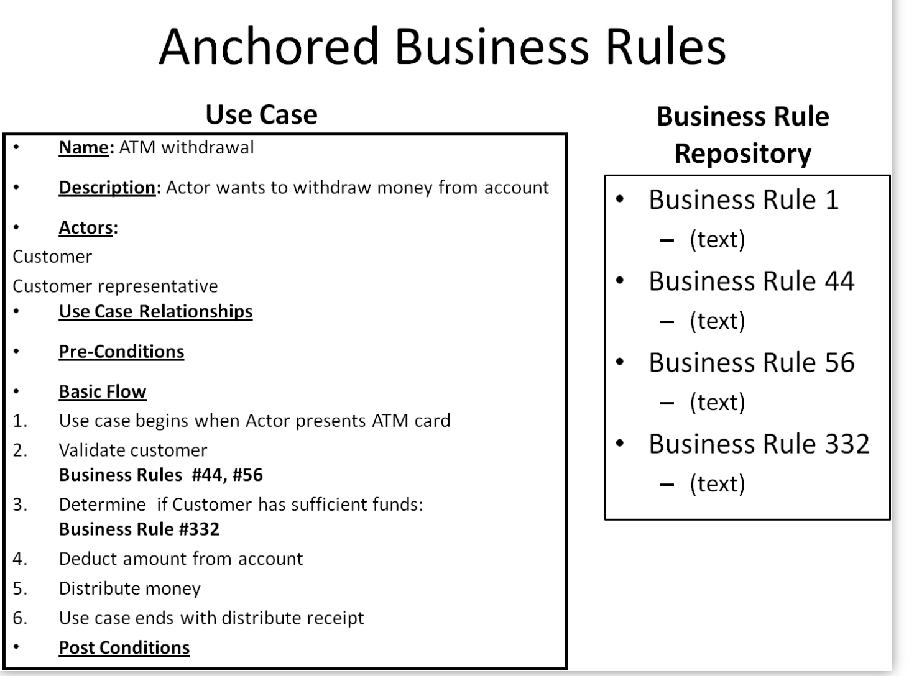

Table of Contents

=================


​     \* [参考对象](#参考对象)

​     \* [需求用例模板](#需求用例模板)

​     \* [业务逻辑分析模板](#业务逻辑分析模板)

​     \* [任务](#任务)


### 参考对象

12306

携程的火车售票版块

途牛的火车售票版块


### 需求用例模板

- 什么是用例图？用例图展示用户与系统之间的交互流程

  包含四个部分：系统 用户 用例 关系

- 用例表示系统完成的动作或者系统中的某种任务，即用例图中的椭圆形内容叫做用例



- 需求用例模板

  

  不需要所有的内容都填上

> 如果图片不能显示，请开启代理，没有代理可选择https://my.acort.cn/ 20元一个月，稳定快速


### 业务逻辑分析模板

业务逻辑包括业务规则和工作流，而工作流在用例中是存在的，所以可以将业务逻辑的分析与用例分析结合起来

> 参考链接：https://www.modernanalyst.com/Resources/Articles/tabid/115/ID/1442/Use-Cases-and-Business-Rules-Can-They-Work-Together.aspx


更倾向于使用第二种方式




### 任务

- [x] 调研市场上同类产品功能

  ```
  用户端
  
  常用乘车人管理
  票务查询
  订票办理
  退票办理 
  改签办理 
  订单管理
  ```


  ```
  售票端
  
  设置展台票数
  新闻广告页面管理
  ```

  ```
  系统管理端
  
  用户权限管理（黑名单）
  系统日志查看
  数据分析
  ```

- [ ] 对整个系统完成用例分析（角色以及功能）

- [ ]  对每个功能完成业务逻辑分析

